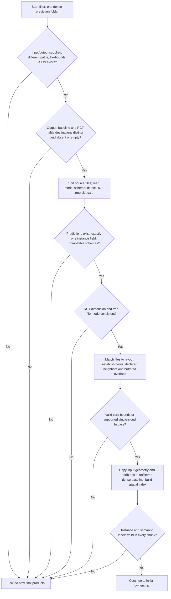
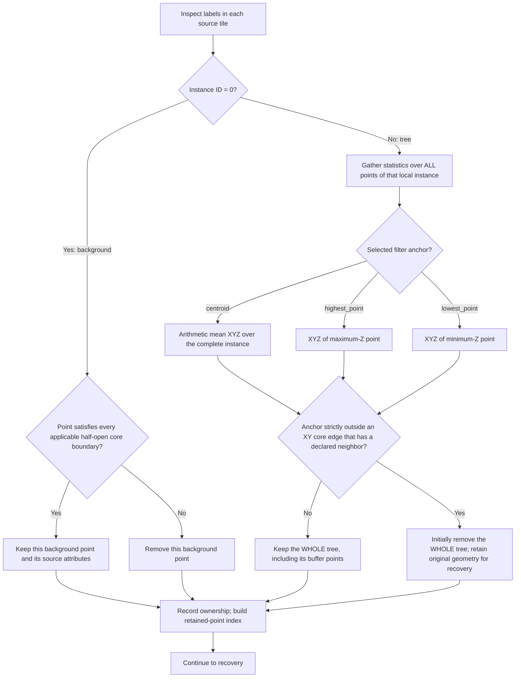
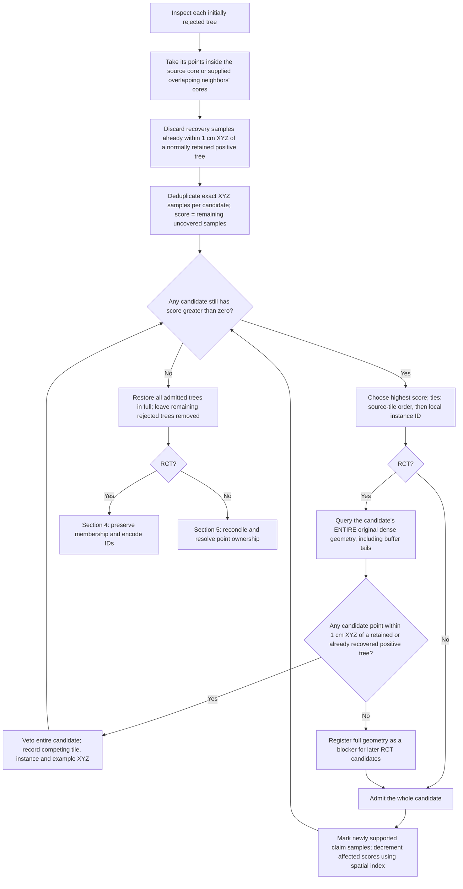
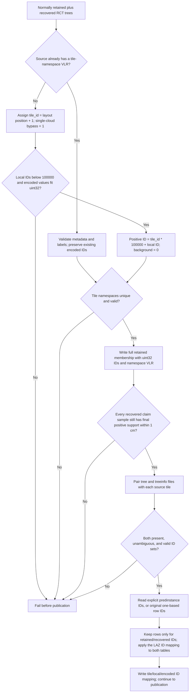
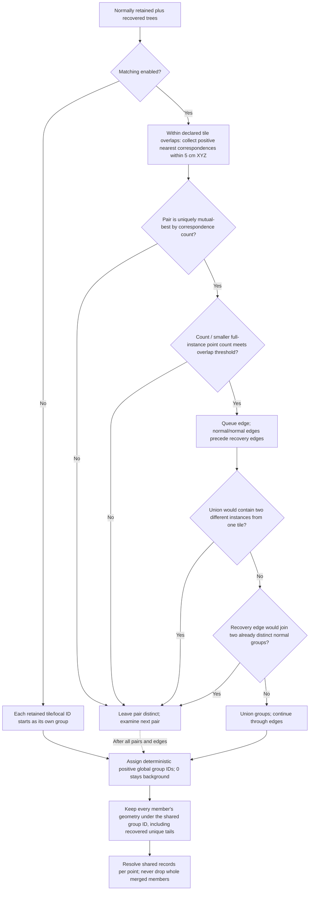
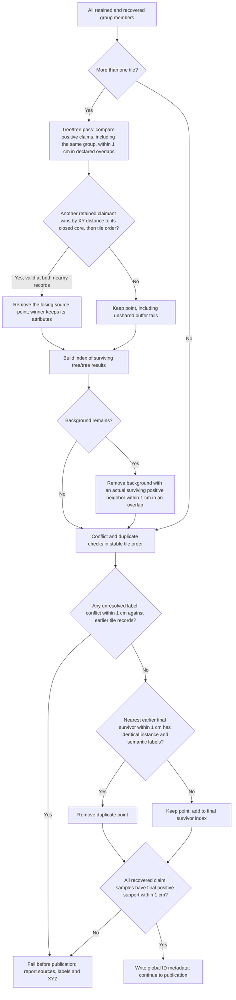
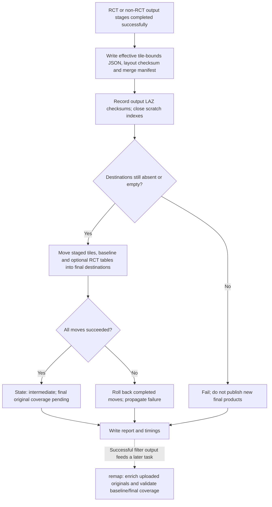

# Filter task: complete decision flow

Scope: `python src/run.py --task filter` on the implementation committed in
`9bfe1be`. Follow sections 1–3, then **either** section 4 (RCT) **or** section 5
(other models), and finish at section 6.

Filter accepts **already-dense predictions** from one model collection. It does
not transfer coarse predictions onto another geometry, enrich originals, or
create a combined final product. The same processing is used after dense
transfer in the merge task. Res1 defaults to 1 cm; the input's density is a caller
precondition, not a measured spacing test.

## 1. Input gates, layout and baseline

- Label checks reject negative, nonfinite, fractional or declared no-data labels;
  instance labels must fit uint32. Background ID **0 is valid**, unless the
  source explicitly declares it as missing. Label scaling must be normalized.
- RCT requires `PredInstance_RCT` and paired `_trees.txt` / `_trees_info.txt`
  sidecars. Exact pairing and table contents are validated in section 4.
- Explicit JSON cores take precedence. Older metadata may derive cores from
  buffered bounds and `tile_buffer`, trimming only sides with declared neighbors.
- A declared neighbor still affects ownership when its file is absent from the
  input subset. Missing files do not expand the surviving tile's core.
- A single-cloud bypass owns its actual extent. Recovery of a historical unused
  grid requires the existing full-extent verification; partial subsets do not
  qualify merely because only one file is present.

Source: [`run_filter_task`](../src/run.py),
[`merge_collections`](../src/strict_prediction_pipeline.py),
[`describe_model`, `prepare_dense`](../src/dense_tile_merge.py),
[`ownership_regions`](../src/dense_instance_ownership.py).

## 2. Initial core ownership

Exact boundary rules, for a core rectangle `[xmin, xmax] × [ymin, ymax]`:

| Edge has a declared neighbor | Reject tree if anchor… | Keep background only if point… |
| --- | --- | --- |
| West | `x < xmin` | `x >= xmin` |
| East | `x > xmax` | `x < xmax` |
| South | `y < ymin` | `y >= ymin` |
| North | `y > ymax` | `y < ymax` |

An edge without a declared neighbor imposes no clipping test. Tree anchors
exactly on an internal edge pass both tiles' inclusive checks. Background uses
half-open edges, assigning a shared upper boundary to the east/north neighbor.
Ownership uses **XY**, even when the anchor was selected using Z. Equal extrema
choose the first point in source order. Source semantics are retained per point.

Source: [`filter_owned_instances`, `owned_anchor`, `owned_background`](../src/dense_instance_ownership.py).

## 3. Recovery loop, including the RCT veto

**Precisely what blocks RCT recovery:** one positive point belonging to a
normally retained or earlier recovered instance, at a distance **at most 1 cm**
from any candidate point. The check includes the candidate's full geometry and
all spatially matching retained trees; it is not limited to its unsupported
core samples. The identity is `(tile, local ID)`. Equal local numbers on different
tiles still identify different instances. Background never blocks recovery.
Another removed candidate becomes a blocker only after admission.

For non-RCT, no whole-instance conflict veto is applied at this stage. Those
instances enter the reconciliation and point-resolution path below.

The selection score uses distinct initially unsupported core samples, updated
with support from admitted candidates' claim samples. Full-instance geometry is
restored after selection. The RCT gate independently indexes each admitted
instance's **full geometry** immediately, so a buffer conflict can veto the next
candidate even when that buffer point was not a scoring sample.

No eligible core samples, complete existing support, a reduced score of zero,
or an RCT veto all leave the candidate removed. Background points are never
restored by whole-tree recovery. There is no minimum tree size or confidence
threshold in this recovery decision.

Source: [`recover_orphaned_instances`](../src/orphan_instance_recovery.py),
[`select_claims`](../src/orphan_claims.py),
[`RayCloudRecoveryGate`](../src/raycloud_recovery.py).

## 4. RCT output decisions

Table validation requires unique positive uint32 IDs, the same ID set in both
tables, and rows for all source instances in the ownership report. Missing rows
fail even when the corresponding source instance was removed. Extra table rows
without retained points are omitted. Repeated filtering reads explicit IDs,
preserves gaps and never applies the tile offset twice.

RCT does **not** run cross-tile instance reconciliation, nearest-core point
reassignment, tree/background point deletion, or cross-tile deduplication here.
The recovery veto does not retroactively inspect or reject overlaps between two
trees that both passed the initial core-ownership check. That limitation is
distinct from checking whether a newly recovered tree would add a conflict.

Source: [`namespace_rct_tiles`](../src/raycloud_instance_ids.py),
[`filter_tree_sidecars`](../src/raycloud_tree_files.py).

## 5. Non-RCT reconciliation and point filtering

### 5a. Matching instances and retaining combined geometry

The default overlap threshold is **0.3** (`--overlap-threshold`). The 5 cm
correspondence radius is the shared pipeline default used by the filter route.
Correspondences are counted from the later tile's points to nearest points in
the earlier tile, not as a symmetric intersection of exact XYZ sets. Equal-best
pair counts are ambiguous and rejected. Recovery edges are considered by
descending correspondence count after normal/normal edges, with stable ties.

`--disable-matching` disables cross-tile unions. It does **not** disable recovery,
global ID allocation, shared-point ownership or deduplication for non-RCT.
Every accepted transitive group has one ID and the union of its members’ geometry.
Unique points keep their source attributes. At shared points, the owning tile
supplies the surviving record and its semantics; there is no majority vote.

### 5b. Resolving shared points and removing duplicates

- Tree claim ranking is **distance to the closed XY core rectangle**, not to
  the tree centroid or tile center. Source filename order breaks equal-distance
  ties. Only retained positive claimants participate.
- Preference is checked at both nearby records. Two nearby but distinct points
  on opposite sides of a core bisector can legitimately keep their respective
  owners. The conflict checker allows that case.
- Background/background semantic differences are allowed; each keeps its
  spatial owner's semantics. Other unresolved instance/semantic disagreements
  fail, including conflicts involving a neighbor that is not the nearest point.
- Duplicate removal compares instance ID plus semantic label when present.
  Other extra attributes are not part of that equality test. It queries the
  nearest actual earlier survivor, with stable tile/point ties. Same-tile points
  never delete one another.
- Recovered-support validation requires **a positive final tree** near each
  required claim sample, not necessarily the candidate's original local ID.

Source: [`reconcile_instances`, `deduplicate`](../src/dense_tile_merge.py),
[`assign_shared_points`](../src/dense_instance_ownership.py),
[`PointIndex.conflicting_match`](../src/bounded_point_index.py).

### 5c. Optional small-instance reassignment

Enabled only with `--reassign-small-instances`; never for RCT.

- Deduplication streams each final instance's point count, XYZ bounds and
  centroid sums from the surviving records.
- Small: fewer than `--max-cluster-size` points (default 3000) **and** a
  bounding box below `--max-volume-for-merge` (default 4 m3).
- A small instance takes the ID of the non-small instance with the nearest
  XY centroid (horizontal distance; height is ignored) within 5 m, or keeps its ID. Small instances never receive other small ones.
- Tiles are relabelled in one pass only when something changes; geometry,
  semantics and scores are untouched. No index is rebuilt: in-task original
  enrichment reads the survivor index and ID compaction folds each reassigned
  ID into its target.

Source: [`small_instance_reassignment`](../src/small_instance_reassignment.py),
[`instance_statistics`](../src/instance_statistics.py), [`compact_originals`](../src/instance_finalization.py).

## 6. Publication and downstream boundary

Outputs:

| Artifact | Contents |
| --- | --- |
| Requested output directory | Processed LAZ tiles, `instance_metadata.csv`, effective `tile_bounds.json`, `smarttile_merge.json`. |
| Sibling `<output-name>_unfiltered_1cm/` | Unfiltered input geometry/labels for the later baseline coverage check. |
| Sibling `segmented_filtered/` for RCT | Both tree tables, pruned and encoded consistently with surviving points. |
| Parent `remap_first_report.json` | Ownership, recovery, mappings, branch-specific conflict/removal metrics, checksums and timings. |

Report sections include `instance_ownership`, `orphan_recovery` (including RCT
`blocked` examples), `reconciliation`, `rct_instance_ids` / `tree_sidecars`, or
non-RCT `semantic_ownership`, `shared_point_ownership`,
`tree_background_ownership` and `deduplication` where applicable. Errors inside
the staged pipeline write a failed report; early argument/preflight failures can
exit before report creation. Publication uses rollback on caught move errors;
it is not a filesystem-wide atomic transaction against process or machine loss.

**The filter task does not validate original-cloud coverage.** The subsequent
remap task requires full baseline coverage, requires full final coverage for
non-RCT, and permits unmatched RCT predictions to become background 0. The final
remap radius defaults to `sqrt(3) × res1` (about **1.732 cm** at 1 cm res1), and
is separate from filter's **1 cm** ownership/support radius and **5 cm**
non-RCT correspondence radius. Distance tests include the shared small float64
roundoff allowance; they do not use a wider physical tolerance implicitly.

The current `run_filter_task` forwards worker count, instance field, anchor,
matching toggle and overlap threshold. It calls the shared pipeline with
`ready=True` and the default first-stage resolution; original-remap options are
handled by `remap` or by `merge` with originals supplied.

Source: [`run_filter_task`](../src/run.py),
[`publish`, `merge_collections`](../src/strict_prediction_pipeline.py).
