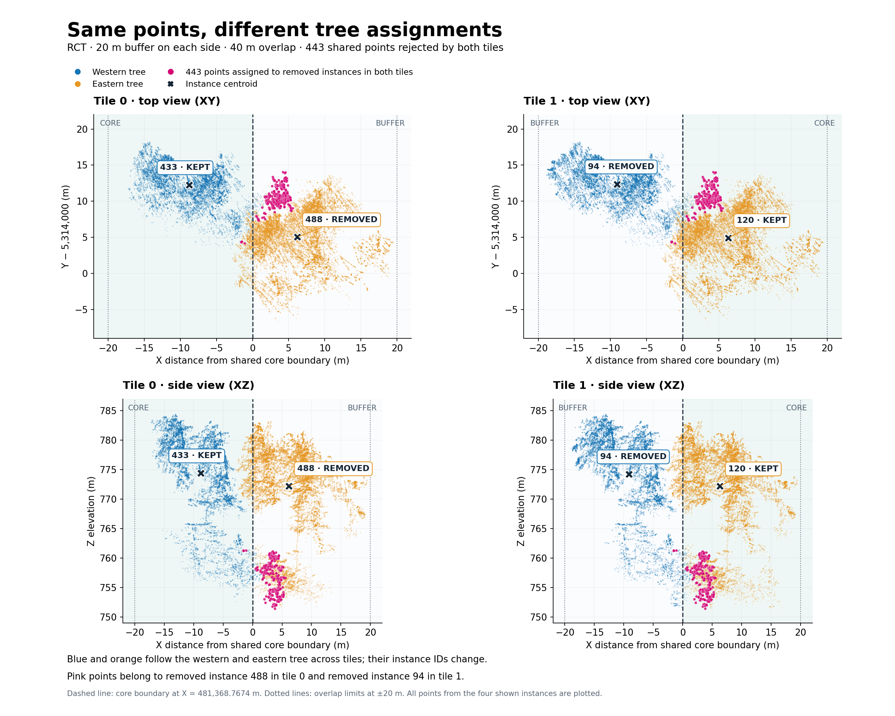

# RayCloudTools: core ownership and unmatched points

SmartTile keeps RCT tree IDs aligned with the accompanying tree and treeinfo
tables. When processing `PredInstance_RCT`, it transfers predictions to the
dense target tiles and filters whole instances by the selected ownership anchor
(`centroid` by default, calculated on the remapped points). An instance whose
anchor lies outside its core toward a declared neighboring tile is removed.
Retained instances keep their original tile-local IDs and per-point attributes.
RCT processing skips cross-tile reconciliation, orphan recovery, point
deduplication, and ID renumbering.

Both `*_trees.txt` and `*_trees_info.txt` are filtered to the retained positive
IDs. Their leading `predinstance` column preserves the original ID even when
rows are removed. IDs can repeat between tiles: identify a tree by its tile and
ID, and keep the corresponding LAZ and text files together. Background 0 does
not create a tree-table row. Missing or inconsistent sidecars fail validation.

## Why both tiles can remove the same points

An overlapping point can receive different tree assignments in two tile runs.
Each tile independently checks the centroid of the instance it predicted. If
both assigned instances have their centroids in their respective buffers, both
copies of the point are filtered out. This can occur while the main counterpart
of each tree is retained in its owning tile.

The 10-million-point local RCT validation on 2026-09-23 used 180 m cores with
20 m of buffer on each side, giving a 40 m overlap between adjacent tiles.
Inspection of its unfiltered dense tiles found:

| Removed instance | Dense points | Main retained counterpart | Points shared with that counterpart |
| --- | ---: | --- | ---: |
| Tile 0, ID 488 | 25,851 | Tile 1, ID 120 | 25,391 |
| Tile 1, ID 94 | 16,876 | Tile 0, ID 433 | 14,727 |

Every coordinate of 488 was present in tile 1, and every coordinate of 94 was
present in tile 0. Most remaining points were assigned to other retained
instances; a small number were background. However, **443 exact XYZ positions
belonged to 488 in tile 0 and 94 in tile 1**. Both instances were removed:
488's centroid lay 6.18 m beyond tile 0's core, while 94's centroid lay 9.11 m
beyond tile 1's core in the opposite direction. Neither retained counterpart
claimed those 443 positions.

Blue and orange follow the western and eastern tree across tiles. Pink shows
the 443 disputed positions; crosses mark the centroids. The dashed line is the
core boundary, and dotted lines show the overlap limits. All points of the four
shown instances are plotted; other neighboring instances are omitted. Z is
original elevation, not height above ground.

This example confirms complete spatial coverage for the inspected points while
showing disagreement about tree membership. Determinism alone does not imply
identical assignments when the two buffered input clouds differ.

## Final remap and background 0

The RCT final remap preserves original point geometry and source attributes.
For each original point:

1. Require a match in the unfiltered dense baseline within the final remap
   radius. This remains a 100% coverage requirement for every model.
2. Search the filtered predictions within the same radius. When a surviving
   prediction is found, copy its prediction values, including its retained ID
   and semantics.
3. If no surviving prediction is found, write `PredInstance_RCT=0` and zero
   every other selected RCT prediction field, including semantics. Keep the
   original point. These points mean background/no assigned tree in the output;
   the coverage report distinguishes fallback zeros from matched background.

The final radius defaults to `sqrt(3) * --resolution-1`: approximately
**0.01732 m (1.732 cm / 17.32 mm)** for a 0.01 m first-stage resolution.
`--remap-tolerance` overrides it in meters. This differs from the earlier
coarse-model-to-dense transfer tolerance, whose default is **0.1732 m
(17.32 cm)**, controlled by `--prediction-transfer-tolerance`.

The 443 rejected dense positions are not a count of final background originals.
Original and dense point counts can differ, and a removed position can still
find a nearby surviving prediction inside the final radius. Only failed final
matches receive fallback 0. This exception applies to RCT; other models still
require complete final coverage. Missing baseline coverage remains an error.

The coverage report records `original_radius_m`, per-file `original_coverage`
entries for `unfiltered_1cm` and `final_survivors`, the final
`unmatched_policy: background_zero`, `background_assigned`, and the aggregate
`background_assigned_points`. Ownership decisions are recorded under
`models[].instance_ownership.tiles[].instances` in the merge report.

## Regression coverage

`tests/test_raycloud_filter_only.py` covers preserved tile-local IDs, both tree
tables, missing sidecars, baseline coverage failure, and zeroed instance and
semantic fields for unmatched originals. Its
`test_shared_point_rejected_by_both_tiles_becomes_background` case models the
opposite-core ownership disagreement above: both tiles contain the same point,
both assigned instances are removed, both main trees survive, and final remap
writes background 0 only for the point with no surviving match. A nearby
original point still receives the retained tree's ID and semantics.
