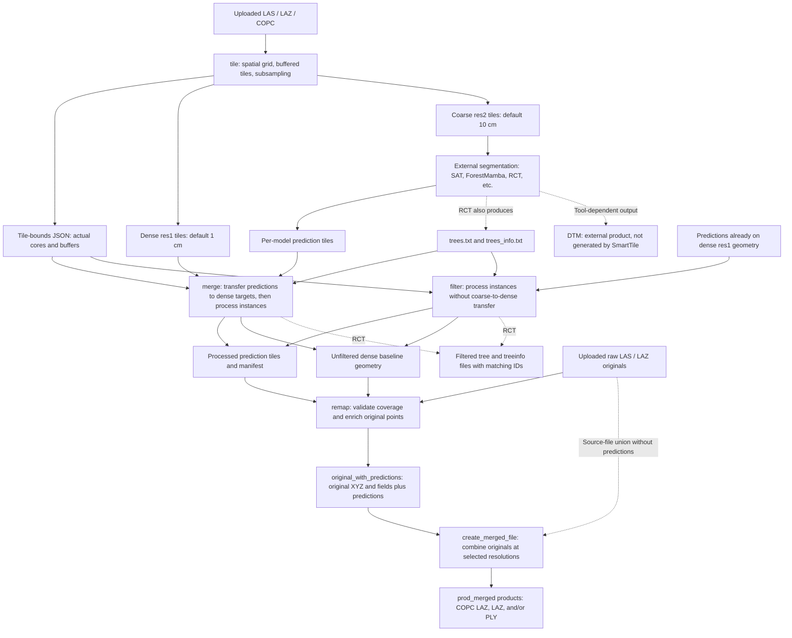
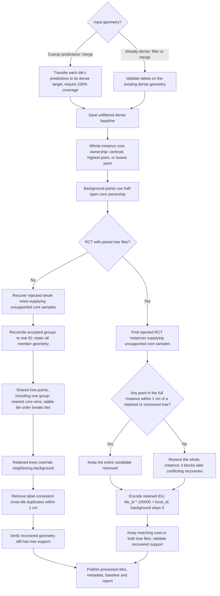

# SmartTile task workflow

This describes the current `src/run.py` task routes. Resolutions below use the
defaults: res1 = 1 cm, res2 = 10 cm. Keep the uploaded originals throughout the
workflow: they supply the geometry and metadata for enriched original products.

## How the five tasks connect

`merge` can accept already-dense predictions as well. It can also perform
original enrichment in the same invocation when originals are supplied.
`filter` writes intermediate tiles; use `remap` afterwards to enrich originals.
The diagram shows the separate tasks so their required artifacts are explicit.
For RCT, keep both tree tables beside each prediction tile when entering merge
or filter. The tables are not required again for standalone remap.

For every filter decision, loop, boundary condition and failure path, see the
[complete filter decision diagrams](filter-decision-flow.md).

## What happens inside merge and filter

Recovery considers candidates in descending count of distinct unsupported core
samples, then stable source-tile order and local ID. Coverage is updated only
near admitted geometry. For RCT, the conflict gate checks **the entire candidate**,
including buffer tails. A single competing positive point blocks recovery;
background does not. Removed candidates do not block other candidates until
admitted. Instance identity includes the tile, even when local IDs match.

RCT processing does not reconcile trees, reassign their points or deduplicate
their membership. Its ID offset is reversible and shared by the LAZ and both
tree tables. Re-filtering preserves that offset. See
[RCT ownership and recovery](raycloud-filter-only.md) for the detailed contract
and the real 488/94 conflict example.

## Task inputs and outputs

| Task | Required input | Processing | Main output |
| --- | --- | --- | --- |
| `tile` | Source point clouds | Spatial indexing, core/buffer layout, COPC tiling and two resolutions of subsampling. A single-cloud bypass records the actual single extent. | Buffered tiles, `subsampled_res1/`, `subsampled_res2/`, tile-bounds JSON. |
| `merge` | Prediction collection(s), matching dense targets unless already dense, and tile-bounds JSON. RCT also requires both tree tables per tile. | Dense transfer, ownership, recovery and model-specific processing shown above. Optional original enrichment. | Processed tiles, `instance_metadata.csv`, `smarttile_merge.json`, effective `tile_bounds.json`, sibling `*_unfiltered_1cm/`, `remap_first_report.json`; RCT `segmented_filtered/` tables; optional enriched originals. |
| `filter` | One already-dense prediction collection and tile-bounds JSON; RCT tree tables where applicable. | Same ownership, recovery and model-specific processing, without a coarse prediction transfer. | Processed tiles, baseline, manifest, report and RCT tables where applicable. |
| `remap` | Processed prediction collection(s), uploaded raw LAS/LAZ originals, and unfiltered baseline geometry. | Coverage validation and bounded nearest-point attribute transfer to the original points. | One enriched file per original and an original-coverage report. |
| `create_merged_file` | Enriched originals, or source files for a source-file union. Optional staged COPC cache and standardization JSON. | Preservation-mode COPC staging, combining files and selecting real source points at requested product resolutions. | `prod_merged_1cm` / `prod_merged_10cm` by default, in selected `copc.laz`, `laz` and/or `ply` formats. |

The baseline path and first-stage resolution are recorded in the merge manifest.
Preserve that relative directory relationship, or supply baseline collections
explicitly with `--baseline-1cm-folders` during remap. The baseline contains
unfiltered geometry so removal of predictions cannot hide an original input gap.

## Matching distances and final coverage

| Check | Distance / rule |
| --- | --- |
| Coarse prediction to dense tile | `--prediction-transfer-tolerance`, default **0.1732 m = 17.32 cm**; every target point must match. |
| Tree support, RCT recovery conflicts and dense duplicate checks | **0.01 m = 1 cm**, measured in XYZ. |
| Original point to dense prediction | Default **sqrt(3) × res1**; for 1 cm voxels this is **0.0173205 m = 1.732 cm**. Override with `--remap-tolerance` in metres. |
| Original to unfiltered baseline | **100% required for every model.** A missing baseline match fails publication. |
| Original to final non-RCT predictions | **100% required.** Missing matches fail publication. |
| Original to final RCT predictions | Prefer the nearest positive tree within the remap radius over background. If no surviving prediction matches, write **0 to every RCT prediction field** and report the fallback. |

Standalone RCT remap validates namespace headers before indexing and validates
each chunk's labels during the indexing read. Spatial queries use bounded
batches; original remap can process batches in parallel while one writer
preserves source point order. Geometry, source dimensions and applicable source
metadata come from the uploaded raw originals.

## Intermediate versus final merged files

- The optional `merged.laz` from `merge` concatenates processed dense tiles. It
  is an intermediate product, available only for a single non-RCT collection.
  Use `--skip-merged-file` for RCT and multiple model collections.
- User-facing `prod_merged_*` products are built from enriched originals using
  `create_merged_file`. Product subsampling selects actual source points rather
  than averaging their attributes. PLY cannot carry LAS CRS/VLR metadata.
- Merge/remap can optionally trigger product creation with
  `--transfer-original-dims-to-merged`; it uses the same product implementation.
- RCT tree/QSM tables remain separate aligned outputs. DTM generation and any
  DTM mosaicking belong to external tools; no SmartTile task produces a DTM.

## Implementation entry points

- Task routing: [`src/run.py`](../src/run.py).
- Tile preparation: [`src/main_tile.py`](../src/main_tile.py) and
  [`src/main_subsample.py`](../src/main_subsample.py).
- Merge, filter and original enrichment:
  [`src/strict_prediction_pipeline.py`](../src/strict_prediction_pipeline.py).
- RCT recovery gate: [`src/raycloud_recovery.py`](../src/raycloud_recovery.py).
- Incremental orphan selection: [`src/orphan_claims.py`](../src/orphan_claims.py).
- Final merged products:
  [`src/main_create_merged_file.py`](../src/main_create_merged_file.py).
