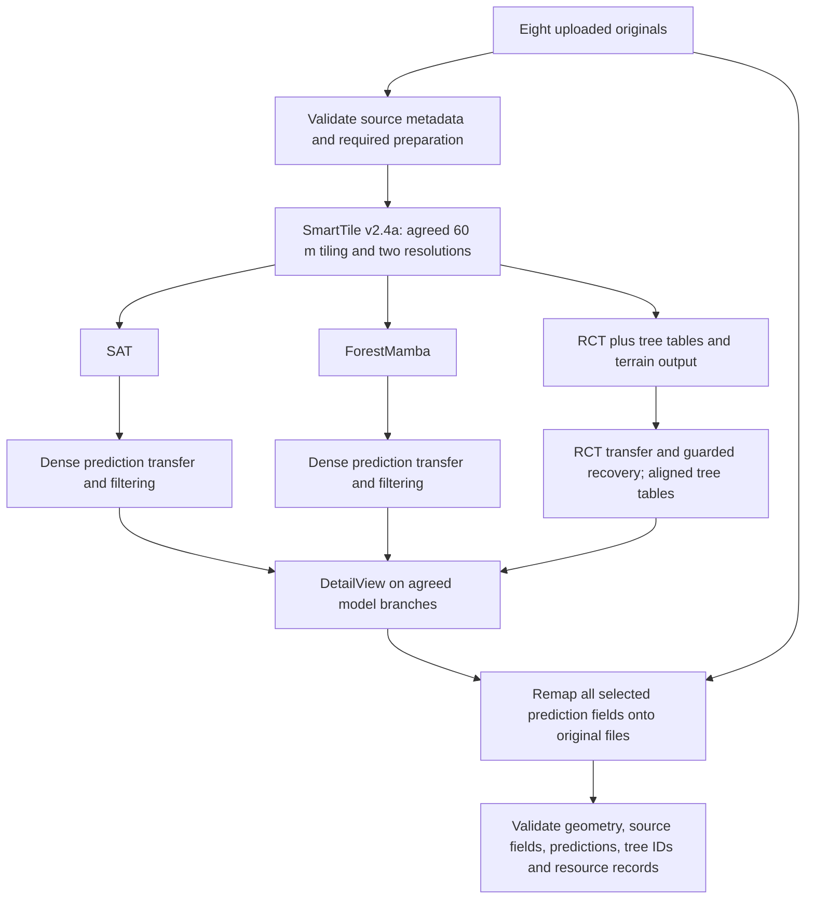

# GFZ SmartTile v2.4a integration suite — planning draft

Status: execution approved. User directs: build the image first, then run
tests and actual file processing. Defer approved old-image/container cleanup
until after the new build and validation. GPU allocation and all-model
compaction are confirmed.

## Requested scope

- Remove prior SmartTile v2.4 test images.
- Build a new v2.4a image and run the regression tests.
- Use the supplied `10_ gfz_test.zip` archive for a reusable integration suite.
- Prepare exactly four tiles in a 2 × 2 layout; retain the requested 60 m core
  width and proposed 20 m buffer; run SegmentAnyTree (SAT), ForestMamba (FM) and
  RayCloudTools (RCT); filter; run DetailView; remap to the original files.
- Work under the previously selected `/mnt/ssds/kg281` workspace.

## Verified input facts

Inspected archive headers directly, without extracting or modifying inputs.

- Eight LAZ files, 16,426,961 point records in total.
- Archive size: 182,131,604 bytes.
- All headers: LAS 1.4, point format 7.
- Source ExtraBytes: `Amplitude`, `Reflectance`, `Deviation`.
- Combined XY bounds: X 398706.857–398739.999;
  Y 5646175.349–5646239.999, approximately 33.142 × 64.650 m.
- WKT VLRs declare metric ETRS89 / UTM zone 33N + DHHN2016 heights;
  runtime CRS parsing remains a preparation check.

| Original file | Point records |
| --- | ---: |
| 398700_5646200.laz | 2,198,572 |
| 398720_5646220.laz | 2,902,628 |
| 398720_5646180.laz | 3,034,469 |
| 398720_5646200.laz | 3,420,435 |
| 398700_5646160.laz | 213,148 |
| 398720_5646160.laz | 654,451 |
| 398700_5646180.laz | 1,799,314 |
| 398700_5646220.laz | 2,203,944 |

## Verified environment facts

- Four RTX A6000 GPUs, indices 0–3, approximately 48 GiB each; idle at inspection.
  Access works outside the restricted sandbox. GPUs 0 and 1 are now authorized.
- Host reports 128 available logical CPUs, 755 GiB RAM and about 7.5 TiB free
  on the destination filesystem. Capacity does not constitute allocation.
- Earlier session authorization: 10 CPUs and 50 GB memory per test container,
  at most five parallel tests. SAT uses GPU 0 and ForestMamba uses GPU 1 in parallel; DetailView
  uses either allocated GPU when free. RCT is CPU-only. Allow at most one
  inference container per GPU.
- Initial Docker inventory: 30 candidate SmartTile test/version tags referencing
  29 distinct image IDs. Some versioned aliases are not explicitly test tags;
  the final removal list must distinguish those from test-only tags.
- Dependent stopped containers exist. Preserve needed evidence before any
  agreed removal; do not perform a global Docker prune.

## Source identity to resolve

Branch: `codex/3dt-2101-remap-first`; last commit at inspection: `3d714ca`.
The checkout now contains additional, uncommitted RCT finalization work:
dataset-wide compact final IDs, provenance mapping, and per-original tree tables.
These changes were not part of the preceding committed v2.4 comparison. The
user has chosen to include compaction and extend it to every segmentation
model, including SAT and ForestMamba. Freeze the source snapshot after that
extension and its regression coverage are implemented.

## Proposed stage graph — full parameter proposal below

The filter CLI accepts already-dense predictions. A segmentation result on
10 cm geometry needs transfer to res1 first; we must select the actual wrapper
output path before deciding whether to call merge or filter in the suite.
DetailView's selected instance fields, species outputs and applicable branches
must likewise be checked against its wrapper and image.

## Interview decision log

1. **Confirmed:** User requests four tiles. Use a 2 × 2 layout. Retain the
   earlier requested 60 m width as core width, with the proposed 20 m buffer.
   Center the junction inside the source footprint so all four cores contain
   data. Verify actual core point counts during preparation. The current tile
   command anchors its grid at the source minimum and ignores `grid_offset`;
   obtaining four populated 60 m cores therefore requires an explicit grid
   layout in the suite or grid-origin support. Generate jobs and metadata from
   that same layout; do not relabel normally generated tiles after extraction.
2. **Confirmed:** Include final ID compaction for every segmentation model,
   not only RCT. Use a separate dataset-wide mapping per instance dimension:
   positive IDs present across all final original files become 1..N; background
   stays 0. One instance keeps the same compact ID across original-file
   boundaries. Relabel consistently in linked tree tables and retain provenance.
   This is final ID relabeling: preserve point membership and semantic/species
   values. Intermediate IDs remain available for linking earlier outputs.
   Current code performs final compaction only for RCT. SAT/FM reconciliation
   assigns consecutive group IDs earlier, but does not guarantee gap-free IDs
   after final remapping. Generalize finalization and test this explicitly.
3. **Confirmed:** Use GPUs 0 and 1 for parallel model branches; preserve
   10 CPUs / 50 GB per container and at most five simultaneous containers.

4. **Confirmed:** Archive old test-container evidence, then remove those
   stopped/created containers to allow scoped image cleanup.
5. **Pending:** Final shared-understanding and complete parameter approval for
   the resolved proposal below, including exact destination and wrapper override.

## Candidate acceptance checks

These are proposed checks, not completed results:

- Full regression suite runs in the exact v2.4a image, with test dependencies
  available and a recorded immutable image ID.
- Every original retains its point count/order, XYZ encoding, standard fields,
  ExtraBytes and applicable metadata after enrichment.
- SAT, FM and RCT dimensions remain distinct; DetailView outputs retain their
  originating instance identity and model-specific field names.
- Dense transfer and baseline original coverage are complete; non-RCT final
  coverage is complete; RCT background fallback is counted explicitly.
- For each model, positive IDs across the final original collection equal
  1..N (or are empty), background remains 0, and the mapping is deterministic.
  Compact IDs are scoped to their model, not shared between models. Verify
  repeated IDs across original boundaries, gaps, all-background input,
  model-specific instance dimensions, and unchanged semantics/species.
- Positive RCT IDs and both final tree tables agree under the chosen identity
  contract; provenance remains recoverable. Apply the same ID translation to
  other linked per-instance outputs wherever such outputs exist.
- No stage silently drops input files. Record stage duration, CPU, RAM, GPU and
  scratch use. Stop at the first failure and retain its reproducible inputs.
- Keep independent regression coverage for historical failure classes not
  represented by this small spatial footprint.

## Glossary for this suite

- **Original collection:** the eight supplied point clouds, treated as the
  reference for final point and attribute preservation.
- **Model branch:** predictions from one of SAT, ForestMamba or RCT; labels
  belonging to different branches remain separate.
- **Final ID compaction:** a one-to-one relabeling of surviving positive
  instance IDs into a consecutive sequence, independently for each model over
  the whole original collection; background is 0.
- **Core:** the region used to select a tile's instance ownership.
- **Buffer:** additional neighboring geometry supplied around a core.
- **Dense baseline:** unfiltered res1 geometry retained for final coverage checks.
- **Integration suite:** a reproducible sequence with artifact validation after
  every stage; success is more than container exit status.

No ADR has been created: no new hard-to-reverse trade-off has been agreed yet.

## Workflow compatibility check

Freshly fetched monorepo `origin/main`: `8cfd06ee26ae375f66e2bb59d2fe6045434f8599`.
Its production workflow requests SAT 1.2.3, ForestMamba 1.0.0 and DetailView
1.1.1, but pins Galaxy-tools commit
`3e86117303c175758cffd6d656a119486443cdf1`, containing SAT 1.2.1,
DetailView 1.1.0 and no ForestMamba wrapper. This is a reproducibility mismatch;
the suite needs explicitly compatible newer wrappers and image/source pins.
RCT is an additional requested branch, using the previously requested patched
v1.2.2 tool rather than the old production pin. Resolve this deviation in the
final parameter review. No production workflow files have been changed.

## Cleanup decision — approved

The candidate image inventory has 63 dependent containers (61 exited, two
created; none running at inspection). Proposed handling: archive their logs and
container metadata, then remove only containers belonging to the selected old
SmartTile test images before removing those test tags. Preserve all dataset
outputs and unrelated/release image tags. Do not force-delete shared image IDs
or perform a global prune. The user has approved this additional container removal. Execution remains
behind the final plan gate requested by grill-with-docs.

## Resolved execution proposal — awaiting final plan approval

Backend: direct local Docker. Destination:
`/mnt/ssds/kg281/smarttile-v2.4a-gfz-20260924`; scratch: its `work/` directory.
Inputs are the eight originals from the attached ZIP, extracted into this new
run directory and mounted read-only. Retain the archive checksum, original
headers and exact source revision/patch fingerprint in `manifest.json`.

The eight input WKT VLRs identify ETRS89 / UTM zone 33N (EPSG:25833 horizontal)
with DHHN2016 orthometric heights, in metres. Validate CRS parsing and consistent
headers in the built runtime. Proposed preparation uses these originals directly;
skip production standardization, which could remove or normalize original fields.
No overview, Potree, production upload, or separate prod-merged export is requested.

### Image and source pins

Use compatible wrappers from Galaxy-tools
`39f5e660928ff1202c969097b9e099972d81e983`, explicitly overriding the stale
monorepo gitlink. Record exact image IDs/digests after the parameter gate and
verify the actual image CLI before any point processing.

| Tool | Proposed image | Difference from production workflow |
| --- | --- | --- |
| SmartTile | `smarttile:v2.4a` | Build this branch plus approved all-model compaction and four-core layout support; freeze patch fingerprint |
| SAT | `ghcr.io/3dtrees-earth/3dtrees_sat:1.2.3` | Same workflow version |
| ForestMamba | `ghcr.io/3dtrees-earth/3dtrees_forestmamba:1.0.0` | Same workflow version |
| DetailView | `ghcr.io/3dtrees-earth/3dtrees_detailview:1.1.1` | Same version; add RCT branch |
| RCT | `rct:v1.2.2-pr3-cgroup` | Requested local patched v1.2.2 branch; ID `sha256:2f1d970c0623e5cc1a86079e83a5341a91e809cb32cb42a657280b8a873d1ced` |

The RCT image inherits old 1.2.0 labels. Verify actual packaged source against
the earlier v1.2.2 PR integration evidence; do not interpret inherited labels as
proof of the patched version. Stop and resolve any source/CLI mismatch.

### Parameters and stage wiring

Unlisted legacy SmartTile reassign/prod-merged controls are inactive. Run
standard regression tests in the new image, then the GFZ suite. Also exercise
three/four-tile conflicts, all-model compaction, and RCT table consistency with
small controlled regression fixtures; this real input alone cannot prove every
historical failure class.

| Stage / parameter | Production / wrapper | Proposed effective value and reason |
| --- | --- | --- |
| Tile input | Standardized collection | Eight original LAZ files; validate directly and preserve source fields |
| Tile length / buffer | 300 m / 20 m in workflow | 60 m core / 20 m each side; four populated cores in a 2 × 2 grid |
| Grid origin | Source minimum | Junction at source-footprint midpoint, (398723.428, 5646207.674); southwest grid corner 60 m below it on each axis. Jobs and metadata use identical geometry |
| Tiling threshold | 20000 MB | Force tiling; no whole-cloud bypass |
| Resolutions | 0.01 / 0.1 m | Same; 1 cm baseline and 10 cm model inputs |
| Subsampling | center-of-mass | Same |
| Output formats | res1 COPC, res2 LAZ | Same |
| Read chunk size | 20,000,000 points | 1,000,000 to bound memory |
| Tile workers | Derived | Two source and two writer workers; five threads per writer, ten spatial chunks, within 10-CPU container limit |
| SAT input / output | One 10 cm tile; SAT instance/semantic fields | Four mapped jobs; `PredInstance_SAT`, `PredSemantic_SAT` |
| SAT resource log | false | true; also collect container-level metrics |
| FM input / model | 10 cm tile; v6 epoch 1500 fixed checkpoint | Same; four mapped jobs |
| FM bluepoint iterations | 0 | 0 |
| FM score threshold | unset | unset (model default) |
| FM second-pass threshold | 0.01 | Same; inactive with zero extra iterations |
| FM spatial tolerance | 0.01 m | Same |
| FM write chunk | 1,000,000 | Same |
| FM dimensions | `PredInstance_FM`, `PredSemantic_FM`, `PredScore_FM` | Same |
| FM preprocess workers | Galaxy slots | 10 |
| RCT input | Additional branch | Four 10 cm tiles, XYZ-dependent processing |
| RCT gradient | wrapper 1 | 1 |
| RCT max diameter / crop length / distance limit | 0.9 / 1 / 1 m | Same |
| RCT minimum height / girth-height ratio | 2 m / 0.12 | Same |
| RCT global taper / factor / gravity | 0.024 / 0.3 / 0.3 | Same |
| RCT branch segmentation / branch data | false / false | Same; IDs identify trees |
| RCT treeinfo | wrapper false | true; require both trees and trees_info tables |
| Dense transfer | v2.4 implementation | Per-tile 10 cm prediction → corresponding 1 cm baseline, maximum 0.1732 m, complete coverage required |
| Filter inputs | Already-dense collections | Separate SAT, FM, RCT collections; explicit generated tile bounds |
| Filter anchor | centroid | Same |
| SAT/FM matching | true; overlap 0.3 | Same; current 5 cm correspondence radius; nearest-core ownership resolves surviving shared claims |
| RCT matching/reassignment | sidecar mode | Disabled; whole-instance filtering and guarded orphan recovery only |
| Filter workers | CLI default 2 | 10, CPU capped |
| Filter filenames / format | `_filtered`; preserve format | Same, consistent tile identity and sidecar links |
| DetailView branches | SAT and FM | SAT, FM and RCT, per retained tile |
| DetailView instance field | branch instance dimension | `PredInstance_SAT`, `PredInstance_FM`, `PredInstance_RCT` |
| DetailView model / augmentations / backend | Europe / 10 / torch | Same; `/app/model_europe_v1` |
| DetailView output | both | LAZ plus prediction CSVs |
| DetailView species fields | SAT/FM suffixes | `species_id_{SAT,FM,RCT}` and `species_prob_{SAT,FM,RCT}` |
| Final remap source | Two prediction collections | Three DetailView collections; carry manifests, baseline references and RCT sidecar links through staging |
| Final remap targets | Original collection | Eight untouched uploaded originals |
| Final remap fields | Workflow selected model fields | Explicit allowlist of each model's instance, semantic/score if emitted, and species/probability fields; no source-field collisions |
| Final remap tolerance | v2.4 automatic | sqrt(3) × 0.01 m = 0.017320508 m; all baseline coverage required; existing RCT survivor misses become background and are counted |
| Remap worker / memory budget | Derived | 10 workers, at most 50 GiB; hard container budget as below |
| Final compaction | Pending RCT-only implementation | All instance dimensions independently compact over whole dataset, uint32, 0 unchanged, preserve membership and non-ID attributes |
| Linked final tables | Pending RCT tree exports | Translate RCT tree tables and any exported DetailView per-instance rows with the same model mapping; retain intermediate tables and provenance |

Implement the dense-transfer fixture step using SmartTile's existing transfer
code, then invoke the actual `filter` task on its dense outputs. Test the
combined merge path against equivalent fixtures as regression coverage. Do not
feed 10 cm predictions directly into the already-dense filter path.

### Resource scheduling and metrics

- SAT uses GPU 0; ForestMamba uses GPU 1. DetailView reuses either GPU when free.
- At most one inference container per GPU, at most five containers overall.
- Every container: 10 CPUs, 50 GiB RAM, no additional swap allowance;
  `GALAXY_SLOTS=10`. Cap nested native thread pools to avoid oversubscription.
- RCT, filtering, remap and validators are CPU tasks with no GPU exposure.
- Record wall time, CPU time, peak container RAM, GPU memory/utilization samples,
  disk usage and point/instance counts. GPU peaks are sampled observations.
- Stop scheduling dependent work on first failed stage. Retain evidence and do
  not automatically repeat expensive inference.

### Deliverables and acceptance

- Eight enriched originals with exact point order/count, XYZ encoding, source
  dimensions and applicable metadata preserved.
- Three distinct model prediction/species families with dataset-wide compact
  instance IDs and per-model mappings back to intermediate identities.
- Final RCT trees/trees_info tables aligned with each original's surviving IDs;
  consistent translated DetailView tables where exported.
- RCT terrain meshes retained as terrain products. This suite does not claim a
  raster DTM or QSM accuracy assessment from file consistency checks.
- Exactly four populated core regions; baseline/transfer coverage assertions;
  explicit metrics for background fallbacks and recovery/conflict decisions.
- Reusable suite, manifest, commands, logs, stage validators and resource report.
- Successful execution and consistency checks establish coverage for these
  fixtures, not unrestricted production readiness or perfect segmentation.

### Approved cleanup scope

User approved archiving logs/configuration and removing the old test containers.
Refresh the inventory immediately before deletion; only remove stopped/created
containers tied to the explicitly listed old test tags. Check mounts and archive
any needed outputs in container writable layers before removal. Never remove a
running container or an unrelated image. Preserve old on-disk dataset results.
Archive sanitized configuration and logs under the new run's `archive/`.

Remove old local `smarttile` test tags from the reviewed inventory. Preserve
`ghcr.io/3dtrees-earth/3dtrees_smart_tile:2.4.0`; deleting a local alias sharing
its image ID will not reclaim those shared layers. Do not use global prune or
force-remove shared release images. Build `smarttile:v2.4a` after scoped cleanup.

Reviewed old local test tags to remove (revalidate existence at execution):

- `smarttile:pr3-rct-background-20260923`
- `smarttile:pr3-v13-orphan-recovery-20260923`
- `smarttile:pr3-v13-orphan-recovery-r2-20260923`
- `smarttile:pr3-v12-dynamic-remap-20260923`
- `smarttile:pr3-v11-uint32-20260923`
- `smarttile:pr3-v10-parallel-remap-20260923`
- `smarttile:instance-uint32-20260923`
- `smarttile:instance-uint32-kg281-20260923`
- `smarttile:pr3-v10-las10-headerfix-20260923`
- `smarttile:pr3-metadata-v10-20260922`
- `smarttile:pr3-query-threads-v9-20260922`
- `smarttile:pr3-nearest-core-v8-20260922`
- `smarttile:pr3-transfer-1732-v7-20260921`
- `smarttile:pr3-tree-priority-v6-20260921`
- `smarttile:pr3-resource-optimized-v5-20260921`
- `smarttile:pr3-resource-optimized-v4-20260921`
- `smarttile:pr3-resource-optimized-v3-20260921`
- `smarttile:pr3-resource-optimized-v2-20260921`
- `smarttile:pr3-resource-optimized-20260921`
- `smarttile:pr3-shared-points-fast-20260921`
- `smarttile:pr3-shared-points-20260921`
- `smarttile:pr3-6e0de4f-copc-fix`
- `smarttile:pr3-6e0de4f-scan-angle-fix`
- `smarttile:pr3-6e0de4f-fixed-build`
- `smarttile:v2.4.0-2361e24`
- `smarttile:v2.4.0-ec1b0f2-test`
- `smarttile:v2.4.0-ec1b0f2`
- `smarttile:v2.4.0-final-test`
- `smarttile:v2.4-conda-lock-test`
